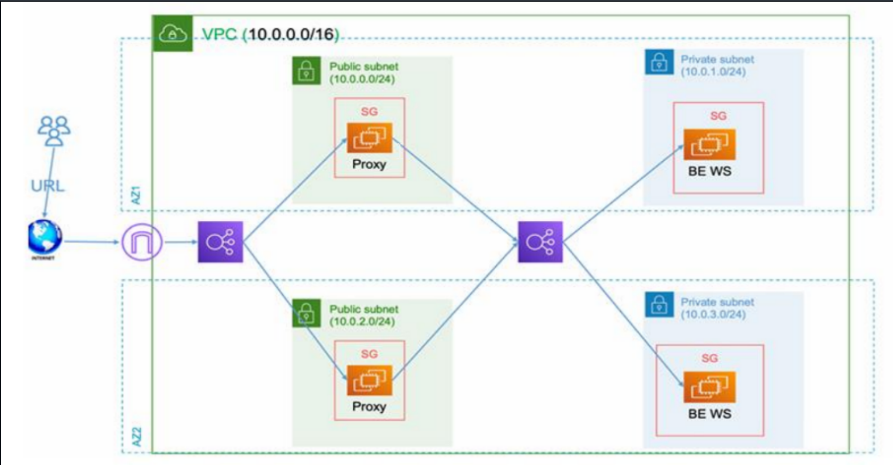

# Terraform Project

Minimal Terraform project that deploys a VPC, proxy/load-balancer components, and a backend application. Includes a small local example app.

## Architecture Diagram

## Repository structure

- Root Terraform files
  - [.terraform.lock.hcl](.terraform.lock.hcl)
  - [main.tf](main.tf)
  - [providers.tf](providers.tf)
  - [variables.tf](variables.tf)
  - [outputs.tf](outputs.tf)
  - [terraform.tfvars](terraform.tfvars)
  - [README.md](README.md)

- Terraform working data
  - [.terraform/modules/modules.json](.terraform/modules/modules.json)
  - [.terraform/providers/registry.terraform.io/hashicorp/aws/5.100.0/windows_386/](.terraform/providers/registry.terraform.io/hashicorp/aws/5.100.0/windows_386/)
  - [.terraform/providers/registry.terraform.io/hashicorp/local/2.5.3/windows_386/](.terraform/providers/registry.terraform.io/hashicorp/local/2.5.3/windows_386/)

- Local app
  - [app/app.py](app/app.py) — contains the backend example (see [`print("Hello from backend!")`](app/app.py))

- Reusable modules
  - Backend app
    - [modules/backend-app/main.tf](modules/backend-app/main.tf)
    - [modules/backend-app/outputs.tf](modules/backend-app/outputs.tf)
    - [modules/backend-app/variables.tf](modules/backend-app/variables.tf)
  - Load balancers
    - [modules/load-balancers/main.tf](modules/load-balancers/main.tf)
    - [modules/load-balancers/outputs.tf](modules/load-balancers/outputs.tf)
    - [modules/load-balancers/variables.tf](modules/load-balancers/variables.tf)
  - Proxy
    - [modules/proxy/main.tf](modules/proxy/main.tf)
    - [modules/proxy/outputs.tf](modules/proxy/outputs.tf)
    - [modules/proxy/variables.tf](modules/proxy/variables.tf)
  - VPC
    - [modules/vpc/main.tf](modules/vpc/main.tf)
    - [modules/vpc/outputs.tf](modules/vpc/outputs.tf)
    - [modules/vpc/variables.tf](modules/vpc/variables.tf)

## Prerequisites

- Terraform (use the version compatible with the providers in the repo)
- AWS credentials configured (e.g., via AWS CLI or environment variables)
- Optional: Python to run the local example app

## Configuration

Edit [terraform.tfvars](terraform.tfvars) to set environment values. Key variables provided in this repo:

- [`aws_region`](terraform.tfvars)
- [`key_name`](terraform.tfvars)

Current example values in [terraform.tfvars](terraform.tfvars):
```
aws_region = "us-east-1"
key_name = "vockey"
```

See variable definitions in [variables.tf](variables.tf).

## Quick start

1. Initialize Terraform:
```sh
terraform init
```

2. Validate and plan:
```sh
terraform validate
terraform plan -var-file=terraform.tfvars
```

3. Apply:
```sh
terraform apply -var-file=terraform.tfvars
```

4. Inspect outputs:
```sh
terraform output
```

5. Run the local example app:
```sh
python app/app.py
```
(See the example backend: [`print("Hello from backend!")`](app/app.py))

## Notes

- Module source and interfaces are under [modules/](modules/).
- Provider plugin binaries and module cache are stored in [.terraform/](.terraform/).
- Inspect module inputs/outputs in the module files linked above.

## Useful files

- Root configuration: [main.tf](main.tf), [providers.tf](providers.tf), [variables.tf](variables.tf), [outputs.tf](outputs.tf), [terraform.tfvars](terraform.tfvars)
- Modules: files under [modules/](modules/)
- Local app: [app/app.py](app/app.py)

```// filepath: README.md
# Terraform Project

Minimal Terraform project that deploys a VPC, proxy/load-balancer components, and a backend application. Includes a small local example app.

## Repository structure

- Root Terraform files
  - [.terraform.lock.hcl](.terraform.lock.hcl)
  - [main.tf](main.tf)
  - [providers.tf](providers.tf)
  - [variables.tf](variables.tf)
  - [outputs.tf](outputs.tf)
  - [terraform.tfvars](terraform.tfvars)
  - [README.md](README.md)

- Terraform working data
  - [.terraform/modules/modules.json](.terraform/modules/modules.json)
  - [.terraform/providers/registry.terraform.io/hashicorp/aws/5.100.0/windows_386/](.terraform/providers/registry.terraform.io/hashicorp/aws/5.100.0/windows_386/)
  - [.terraform/providers/registry.terraform.io/hashicorp/local/2.5.3/windows_386/](.terraform/providers/registry.terraform.io/hashicorp/local/2.5.3/windows_386/)

- Local app
  - [app/app.py](app/app.py) — contains the backend example (see [`print("Hello from backend!")`](app/app.py))

- Reusable modules
  - Backend app
    - [modules/backend-app/main.tf](modules/backend-app/main.tf)
    - [modules/backend-app/outputs.tf](modules/backend-app/outputs.tf)
    - [modules/backend-app/variables.tf](modules/backend-app/variables.tf)
  - Load balancers
    - [modules/load-balancers/main.tf](modules/load-balancers/main.tf)
    - [modules/load-balancers/outputs.tf](modules/load-balancers/outputs.tf)
    - [modules/load-balancers/variables.tf](modules/load-balancers/variables.tf)
  - Proxy
    - [modules/proxy/main.tf](modules/proxy/main.tf)
    - [modules/proxy/outputs.tf](modules/proxy/outputs.tf)
    - [modules/proxy/variables.tf](modules/proxy/variables.tf)
  - VPC
    - [modules/vpc/main.tf](modules/vpc/main.tf)
    - [modules/vpc/outputs.tf](modules/vpc/outputs.tf)
    - [modules/vpc/variables.tf](modules/vpc/variables.tf)

## Prerequisites

- Terraform (use the version compatible with the providers in the repo)
- AWS credentials configured (e.g., via AWS CLI or environment variables)
- Optional: Python to run the local example app

## Configuration

Edit [terraform.tfvars](terraform.tfvars) to set environment values. Key variables provided in this repo:

- [`aws_region`](terraform.tfvars)
- [`key_name`](terraform.tfvars)

Current example values in [terraform.tfvars](terraform.tfvars):
```
aws_region = "us-east-1"
key_name = "vockey"
```

See variable definitions in [variables.tf](variables.tf).

## Quick start

1. Initialize Terraform:
```sh
terraform init
```

2. Validate and plan:
```sh
terraform validate
terraform plan -var-file=terraform.tfvars
```

3. Apply:
```sh
terraform apply -var-file=terraform.tfvars
```

4. Inspect outputs:
```sh
terraform output
```

5. Run the local example app:
```sh
python app/app.py
```
(See the example backend: [`print("Hello from backend!")`](app/app.py))

## Notes

- Module source and interfaces are under [modules/](modules/).
- Provider plugin binaries and module cache are stored in [.terraform/](.terraform/).
- Inspect module inputs/outputs in the module files linked above.

## Useful files

- Root configuration: [main.tf](main.tf), [providers.tf](providers.tf), [variables.tf](variables.tf), [outputs.tf](outputs.tf), [terraform.tfvars](terraform.tfvars)
- Modules: files under [modules/](modules/)
- Local app: [app/app.py](app/app.py)
